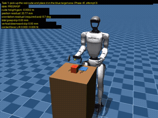
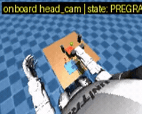
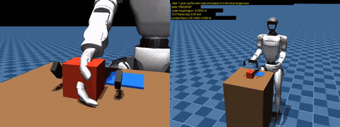
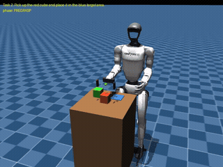
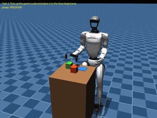

# Unitree G1 Manipulation → VLA Demonstration Pipeline

## 1. Overview

A Unitree G1 manipulation prototype in MuJoCo, built up from a physical
grasping baseline to a VLA-oriented demonstration pipeline:

- **Task 1** — single-object pick-and-place (fixed-base, torso-constrained upper body).
- **Task 2** — object-conditioned two-object selection on the same scene.
- **Task 3** — articulated door-opening: a hinged cabinet door, geometry
  derived from a measured workspace/conditioning map rather than chosen by
  hand. Reaches its target open angle; a disclosed grip-force limitation
  during the pull remains open (§6).
- **VLA pipeline** — RGB + proprioception observations, recorded expert
  actions, HDF5 demonstrations, replay validation (Task 1 only so far).
- All tasks use a **scripted classical expert** — no learned policy or
  language grounding is claimed. Every grasp is produced by physical
  contact and actuation: no teleport, weld, or scripted state overwrite.

### **Written to be read** — the reviewer path:

| Document | What it is |
| --- | --- |
| [`submission/entrance_test_report.md`](submission/entrance_test_report.md) | The full submission report. See **Contributions and Role** for the design decisions and defect catches behind each phase |
| [`slide.pdf`](slide.pdf) | Research presentation — the story in slide form |
| [`submission/DATASET_CARD.md`](submission/DATASET_CARD.md) | Dataset card: intended use, known biases, recommended quality masks (summarised in §5) |
| [`submission/REPRODUCE.md`](submission/REPRODUCE.md) | Every command actually executed, with recorded timings |
## 2. Results at a Glance

| Component | Result |
| --- | --- |
| Task 1 | Pick-and-place completed in the supported reachable envelope |
| Task 2 | 4 configs x 3 deterministic repeats, 12/12 pass |
| Task 3 (door-opening) | Reaches/exceeds the 45deg open target; grip force touches 0.0N at one instant during the pull (disclosed, not hidden) |
| Wrong-object placements | 0 |
| Distractor displacement | <=1.73mm |
| Demonstration pipeline | RGB + proprioception + actions + replay |
| Policy-action replay | 8.09mm canonical max TCP error |
| Tests | 345, 0 unexpected failures |
| Learned policy | Not attempted |
| Isaac Lab | MuJoCo implementation instead |

## 3. Demo

**Task 1 — pick-and-place** (fixed-base G1, physical gripper, no teleport):



Third-person, full episode (approach → grasp → lift → transport → lower →
release → retreat), 12.0s — the episode I reviewed and accepted as the
Task 1 prototype result.



Onboard `head_cam` view (torso-mounted, near head height), 13.3s — the
same camera stream used as a policy-facing observation in the VLA data
pipeline.



Side-by-side diagnostic: **left** — the vendor's decorative hand mesh
visibly clipping through the cube (Phase 4D); **right** — the corrected
gripper after the visual/collision fix (Phase 4E). 4.3s.

**Task 2 — object-conditioned selection** (same scene, different task
specification, different selected object; see `reports/task2-language-selection.md`):



"Pick up the **red** cube..." — red cube grasped and placed; green
distractor undisturbed throughout. 13.2s.



Same physical arrangement, "Pick up the **green** cube..." instead — green
cube grasped and placed; red distractor undisturbed throughout. 13.2s.

## 4. Key Research Findings

- **Controller redesign.** Torque-PD control with a continuous IK solver
failed: heterogeneous per-joint torque limits and coupled tracking
instability shoved the cube out of position before the gripper closed.
Switching to bounded position servos + waypoint IK produced deterministic
grasping (5/5).

- **Nearby-object interference.** An apparently safe 8cm distractor slot
still moved 48.7mm during Task 2, because the arm's RETREAT motion swept
through it. Moving the slot to the shipped position reduced disturbance to
<=1.73mm.

- **Action representation.** A naive low-frequency policy action stream
could not reproduce the expert's 500Hz control trace on replay (up to
~98mm error). Chunking actions into H=5 sub-deltas at an effective 50Hz
reduced canonical replay error to 8.09mm.

- **Workspace conditioning explains two earlier mysteries at once.**
  Mapping the arm's reachability/conditioning directly (a gap Task 1 had
  flagged but never closed) found the quoted "3cm x 4.5cm envelope" was a
  sampling artifact — the real reach toward the body is ~22cm — and that
  Task 1's grasp point sits at the 1st percentile of manipulability across
  the whole workspace. It also found orientation reachability is sharply
  height-dependent: at table height nothing meets a 7deg wrist-alignment
  tolerance anywhere; 10cm higher, dozens of points do. That gap is what
  Task 3's door task exploits.

## 5. VLA Demonstration Pipeline

```text
RGB + proprioception
        |
        v
policy observations

scripted expert
        |
        v
TCP / gripper actions
        |
        v
HDF5 demonstrations
        |
        v
validation + replay
```

- Policy-facing observations and privileged evaluation metadata (e.g.
  `selected_object_id`) are kept separate.
- Observations are recorded at 10Hz.
- Actions are stored as H=5 sub-action chunks at an effective 50Hz.

The dataset card
([`submission/DATASET_CARD.md`](submission/DATASET_CARD.md)) answers four
questions:

| Question | Answer |
| --- | --- |
| What's in it? | 32 Task 1 episodes recorded at **two rates** — a 10Hz policy stream (RGB 160×120, proprioception, TCP pose) alongside a 500Hz execution trace of the literal applied control |
| How is it designed? | Actions are TCP deltas chunked `[T, 5, 3]` at 50Hz — the representation that closed policy-replay error to 8.09mm. Privileged cube/target state sits in a separate group, and every action is derived from the expert's own commanded trajectory by forward kinematics, so privileged state cannot leak into training |
| How good is it? | Replay fidelity is **measured per episode, not assumed**: exact-execution replay lands within 1mm on 29/29 episodes. Recommended quality masks ship alongside the data (`task_execution_through_release`, 24/24, is the default) |
| What are its limits? | Scope is deliberately narrow and disclosed in full in the card — fixed target pad, fixed cube yaw, a 3cm×4.5cm cube-position envelope, and no model trained against it |

The HDF5 itself is untracked (62MB); regenerate it deterministically with
`python3 -m tasks.g1_pick_place.collect_dataset`. Field-level layout:
[`data/schema_v3.md`](data/schema_v3.md).

## 6. Limitations

- Fixed-base, torso-constrained G1 — not full-body or free-standing manipulation.
- MuJoCo, not Isaac Lab (no macOS support on this host).
- No learned policy or VLA model inference — scripted expert only.
- Task 1's stricter <=10mm grasp-slip engineering target is **not** met
  (measured ~25.9mm); task-level pick-and-place otherwise works.
- Task 2 uses privileged object selection (`selected_object_id` supplied
  directly), not natural-language parsing or visual-language grounding.
- Task 3 (door-opening) reaches its target open angle, but bilateral grip
  force touches exactly 0.0N at one instant during the pull, so the
  stricter grip-retention and slip criteria fail — disclosed, not hidden
  (`reports/phase7c-door-motion.md`). No demonstration data collected for
  this task.

## 7. Reproduce

```bash
git submodule update --init --recursive
./setup/preflight_macos.sh
python3.12 -m venv .venv
.venv/bin/pip install mujoco==3.3.6 numpy imageio pillow h5py matplotlib
.venv/bin/python -m unittest discover -s tests
```

Full command list, exact versions, and recorded timings:
`submission/REPRODUCE.md`.

## 8. Repository Structure

```text
tasks/g1_pick_place/    core task scenes, gripper MJCF, controllers
submission/             final report, dataset card, videos
reports/                detailed per-phase experiment reports
tests/                  regression and diagnostic tests
vendor/unitree_mujoco/  pinned upstream simulator (git submodule, never modified)
setup/                  host bootstrap scripts
data/, logs/, artifacts/  datasets, raw evidence, and small evidence media
```

## 9. Detailed Documentation

**Evidence and internal records** — exhaustive by design, not reviewer reading:

| Document | What it is |
| --- | --- |
| [`reports/`](reports/) | 21 per-phase audit reports — the traceable source behind every number above, including Task 3's workspace map, scene, motion, and test phases (`phase7a`-`phase7d`) |
| [`data/schema_v3.md`](data/schema_v3.md) | HDF5 field-level layout, for tooling and dataset users |
| [`HANDOFF.md`](HANDOFF.md) | Chronological engineering history and the per-phase authorization record |
| [`docs/work_log.md`](docs/work_log.md) | Running work log |
