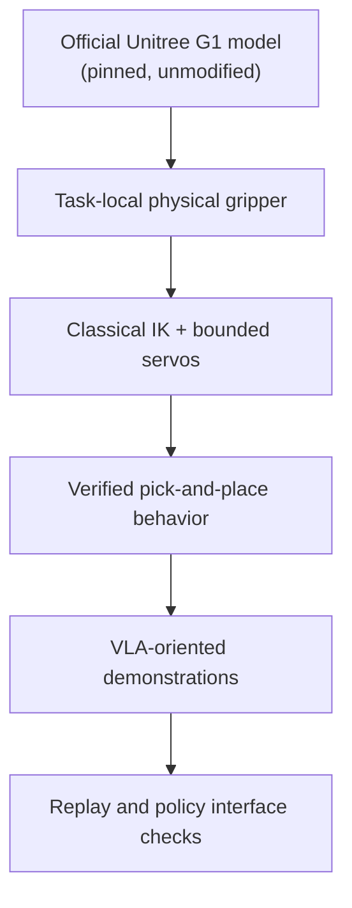

# Trustworthy G1 Manipulation for VLA Research

I built a physically audited Unitree G1 manipulation testbed in MuJoCo, then used it to study the interface between classical robot control and future vision-language-action learning.

Entrance-test project for graduate lab selection

---

# I Treated the Entrance Test as a Research System, Not a Demo

**Host reality**

Isaac Lab was unavailable on Intel macOS, so I used the official Unitree MuJoCo path and recorded the deviation instead of hiding it.

**Physical validity**

Every success had to come from contact and actuation: no cube weld, attachment, teleport, mocap assistance, or post-reset qpos manipulation.

**Research traceability**

I kept phase reports, logs, tests, videos, dataset schemas, and explicit failure records for each design decision.

The project became a small, evidence-driven robotics platform for asking VLA-ready manipulation questions.

---

# The Core Claim: I Can Build the Layer Between Physics and Learning

This is the part many learning projects assume already exists: a trusted embodiment, real contact, repeatable evaluation, and a clean boundary between policy observations and privileged simulator state.

---

# What Was Delivered Within the Time Box

| Area | Delivered evidence |
|---|---|
| Simulator setup | Official `unitree_mujoco` G1, pinned commit, MuJoCo smoke tests |
| Embodiment audit | 29 actuators mapped; wrist, sites, contacts, and G1 variants inspected |
| Manipulation interface | Task-local physical parallel gripper on the right wrist |
| Task 1 | Red cube pick-and-place to blue target, fixed-base G1, real contacts |
| Task 2 | Language-conditioned object selection with red/green cubes |
| Dataset | 32 episodes, 28 successes, RGB + proprioception + actions + privileged split |
| Evaluation | 311 tests, 0 unexpected failures; limitations reported rather than hidden |

Not attempted: Task 3, model training, and model inference. The deck does not claim them.

---

# I Chose a Fixed-Base G1 Because the Measurement Demanded It

**Measured before implementation**

- The free-standing model drifted **0.93 m in 2 s** under small arm torques.
- The stock G1 variants contained no actuated gripper, Inspire hand, or Dex3 hand.
- The stock model had no wrist site suitable as a direct IK target.

**Design choice**

- Use the official **29-actuator G1** body and arm model.
- Add a **task-local physical gripper** under `right_wrist_yaw_link`.
- Fix the pelvis and torso for the first manipulation MVP.
- Keep all vendor files unmodified.

This made the task smaller, but also more honest and testable.

---

# The Gripper Was Physical, Local, and Audited

- Two actuated slide-joint fingers.
- Collision-enabled pads with bilateral contact checks.
- A documented TCP site for IK and replay.
- Cube initialization allowed only before the first physics step.
- No object assistance after the trial starts.

The central technical promise is simple: if the cube moves, it moved because the simulated robot touched it.

---

# A Failed Controller Became the Research Turning Point

**Attempt 1**

Torque PD + DLS IK failed after three documented tuning attempts.

**Diagnosis**

Shoulder/elbow and wrist torque authority differed by about **5x**, so one shared gain design was structurally wrong.

**Replacement**

Bounded MuJoCo position servos + waypoint IK produced deterministic grasp and lift.

The contribution was not just tuning until something worked. It was knowing when the representation itself had to change.

---

# Task 1 Works Inside a Measured Envelope

| Metric | Result |
|---|---|
| Nominal pick-and-place | Deterministic success, 5/5 |
| Reachable setup variants | 3/3 succeed |
| Original five-position coverage | 3/5 |
| Human visual acceptance | Prototype completed with limitation |
| Strict 10 mm grasp-slip bar | Not met: 25.92 mm |

I report the boundary: task-level behavior is reliable in the reachable envelope, while strict grasp quality remains open.

---

# The Best Evidence Was a Bug the Tests Missed

After the tests were already green, visual review showed a decorative vendor hand mesh clipping through the cube.

That did not invalidate the physical contact result, because the mesh was collision-free, but it did invalidate the presentation quality of the evidence.

I removed the misleading visual mesh in the task-local scene and kept the physical audit boundary intact.

This is the kind of failure that only appears when engineering tests and human evidence review are both taken seriously.

---

# The Dataset Was Designed for Future Learning, Not Just Logging

**Policy-facing observations**

- Head/torso RGB camera at 10 Hz
- Robot joint positions and velocities
- TCP pose
- Gripper command/state

**Privileged expert/evaluation state**

- Cube and target poses
- Contact state
- State-machine phase
- Object selection metadata

The important design habit: privileged state is useful for evaluation, but it must not quietly become a learner input.

---

# Replay Fidelity Exposed an Action-Representation Problem

| Replay representation | What it tested | Result |
|---|---|---|
| 10 Hz zero-order hold | Naive action interface | 48.7 mm TCP error |
| Exact 500 Hz execution | Simulator determinism | ~1e-5 m scale error |
| Static 10 Hz phase goal | Coarse goal representation | ~97 mm TCP error |
| **H=5 chunks at 50 Hz** | Shipped policy-action representation | **8.09 mm / 5.99 mm prototype errors** |

The simulator was not the problem. The action interface was.

---

# Task 2 Shows the First Step Toward Language-Conditioned Manipulation

The scene contains two physically identical cubes. The instruction selects which object should be moved to the shared blue target.

- 4 configurations × 3 deterministic trials = **12/12 pass**
- **0** wrong-object placements
- Distractor displacement stays within **0.0–1.73 mm**
- This is task-conditioned control, not learned language grounding

---

# The Most VLA-Relevant Result Is the Clean Boundary

**What already exists**

- Physical manipulation environment
- Language-style task specifications
- RGB/proprioceptive observations
- Demonstration trajectories
- Replay checks and dataset validation

**What remains research work**

- Replace privileged object ID with visual-language grounding
- Train a baseline behavior cloning policy
- Vary target locations and object classes
- Test generalization beyond deterministic repeats

This is a credible starting point for VLA research because the non-learning substrate is already measurable.

---

# Why This Project Fits a Robotics AI Lab

**Robotics**

I can build a contact-rich manipulation task, diagnose embodiment limits, and keep physical validity constraints explicit.

**ML systems**

I think in observation/action schemas, replay fidelity, leakage boundaries, and reproducible datasets.

**Research**

I do not hide failed hypotheses. I use them to decide which abstraction should change next.

---

# The Next Study Is Clear and Small Enough to Execute

| Next phase | Acceptance criterion |
|---|---|
| Behavior cloning baseline | Train/evaluate on Task 1 demonstrations; report success and failure modes |
| Grounded object selection | Replace privileged `selected_object_id` with RGB + instruction input |
| Target variation | Move the blue target in scene geometry and prove replay/camera consistency |
| Grasp quality repair | Reduce true grasp-phase slip below 10 mm without scripted assistance |
| Task 3 | Add a new manipulation primitive only after the above are stable |

The research direction is not "make the demo bigger." It is "remove one privileged assumption at a time."

---
layout: center
class: text-center
---

# What I Want to Contribute

I want to join the lab to work on robot learning systems where VLA policies are evaluated through real physical interaction, clean data interfaces, and honest failure analysis.

This project shows my current level: early in robotics, but already able to build a testbed, debug it quantitatively, and turn it into research questions a lab can continue.

---
layout: section
hideInToc: true
---

# Appendix
## Evidence for Technical Questions

---

# Appendix A1 — Requirement Coverage

| Requirement | Status | Evidence |
|---|---|---|
| Unitree G1 in simulation | Complete | Official G1 in MuJoCo |
| Isaac Lab | Deviation | Not supported on Intel macOS |
| Task 1 | Complete | Pick-and-place, fixed-base, physical gripper |
| Task 2 | Partial/complete within scope | Object-conditioned selection, not language grounding |
| Task 3 | Not attempted | Time-boxed out |
| Model-free environment control | Complete | Classical IK + bounded servos |
| VLA-oriented data pipeline | Complete | RGB/proprioception/actions/privileged split |
| Existing policy inference | Not attempted | No model run |

---

# Appendix A2 — Physical Integrity Rules

- Vendor `unitree_mujoco` files remain unmodified.
- G1 model is pinned at commit `4134cb5dc7ff1ba7f484deda48b5274b58694519`.
- Cube free-joint state may be initialized only before the first physics step.
- After a trial starts: no direct cube qpos/qvel write, no weld, no attachment, no teleport, no mocap manipulation, no applied cube force.
- A guard and automated tests enforce this boundary.

---

# Appendix A3 — Main Limitations

- Strict max 3D grasp-slip target is not met: **25.92 mm** versus 10 mm.
- Two of five original cube offsets are outside the reachable envelope.
- Target location is fixed in the current dataset.
- Task 2 uses privileged object selection metadata; it does not perform learned language grounding.
- Seven of 29 scaled policy-action replays exceed 10 mm, all first diverging after release during RETREAT.
- No model training or inference was attempted.

---

# Appendix A4 — Source Evidence

- Main report: `submission/entrance_test_report.md`
- Machine-readable summary: `submission/results_summary.json`
- Reproduction guide: `submission/REPRODUCE.md`
- Dataset card: `submission/DATASET_CARD.md`
- Phase reports: `reports/phase*.md`
- Logs: `logs/*.json`
- Evidence media: `artifacts/` and `submission/videos/`
- Slide assets: copied from real evidence stills into the Slidev `public/` folder

