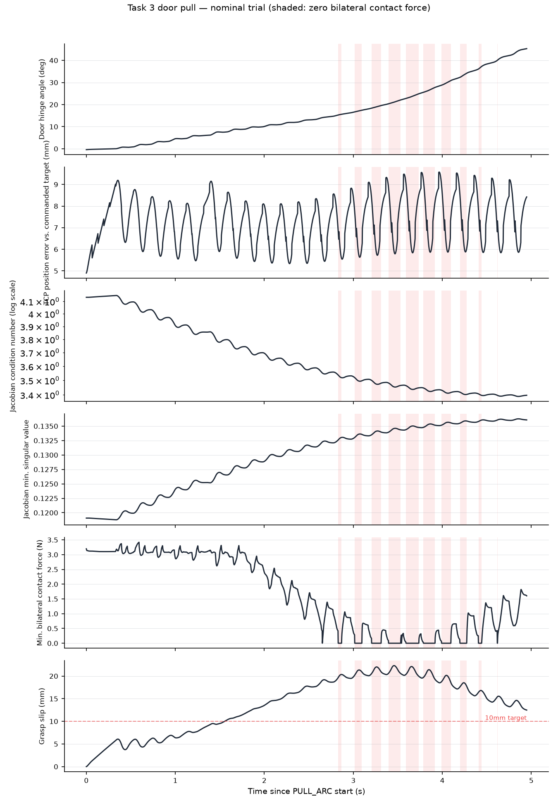

# Phase 7E — Workspace-Conditioning Metric and Door-Pull Slip Causality

> **Evidence record — not reviewer reading.** Exhaustive per-phase audit
> trail, kept so every number in the submission is traceable. The
> reviewer-facing account is `README.md` and
> `submission/entrance_test_report.md`.

Date: 2026-09-06

Prompted by a direct request to substantiate the "workspace conditioning
explains two mysteries" claim in `reports/phase7a-workspace-map.md` with
exact definitions, original measurements, per-step trial data, and a
causal (not merely correlational) test. Implementation:
`tasks/g1_pick_place/phase7e_pull_diagnostics.py` (per-step instrumentation
via `run_trial_door_open`'s existing `frame_callback` hook — no
modification to the trial function itself) and
`tasks/g1_pick_place/phase7e_plot_pull.py`.

## 1-2. Metric definition and computation

Three related quantities of the **3×7 translational Jacobian** `J`
(`grasp_tcp` site, right-arm columns only) at a solved configuration `q`:

- **Manipulability** (Yoshikawa): `w(q) = √(det(J Jᵀ)) = σ₁σ₂σ₃`.
- **Singular values** `σ₁ ≥ σ₂ ≥ σ₃` from `J = UΣVᵀ`.
- **Condition number**: `κ = σ₁/σ₃`.

`σ_min = σ₃` is the most diagnostic: the worst-case ratio of achievable
task-space velocity to joint velocity, i.e. distance from a kinematic
singularity.

Computed via `mujoco.mj_jacSite(model, data, jacp, jacr, site_id)` →
`jacp ∈ ℝ^{3×nv}` for the full model, sliced to the 7 arm DOFs:
`J = jacp[:, arm_map.dof_adr]`, then `numpy.linalg.svd`.
(`workspace_map.py:85-120`, reused unchanged by the per-step instrumentation.)

## 3. The two mysteries — original measurements

Recomputed directly against the live model (not recalled from memory):

**(a) Phase 4A's grasp-envelope boundary.**

| Variant | IK residual | σ_min | κ | Manipulability | Reachable (<8mm) |
| --- | --- | --- | --- | --- | --- |
| `x_minus_0.03` | 5.06mm | 0.0527 | 10.5 | 0.01358 | **yes** |
| nominal | 7.83mm | 0.0140 | 40.6 | 0.00384 | **yes** |
| `y_plus_0.03` | 7.63mm | 0.0121 | 46.9 | 0.00328 | **yes** |
| `y_minus_0.03` | 8.79mm | 0.0084 | 68.7 | 0.00231 | **no** |
| `x_plus_0.03` | 26.95mm | 0.0063 | 90.2 | 0.00174 | **no** |

**(b) Task 1's own operating point.** Nominal grasp manipulability
(0.00384) sits at the **0.2th percentile** of 976 reachable points in the
1,120-point Phase 7A workspace sweep (min 0.00363, median 0.01971, max
0.02415). Task 1 has run at essentially the single worst-conditioned
reachable point on the table.

## 4. Quantitative separation, accepted vs. rejected

n=5 (Phase 4A's own sweep — too small for a significance test, reported as
what it is): accepted σ_min ∈ [0.0121, 0.0527], rejected σ_min ∈
[0.0063, 0.0084]. The two ranges do not overlap; the gap sits between
0.0084 and 0.0121, consistent with the ≈0.010 cut quoted in
`phase7a-workspace-map.md`. This is a real, clean separation in this
5-point sample — not, by itself, proof that σ_min is *the* determining
variable at every point in the workspace (residual and manipulability move
together with it here, so this sample alone cannot separate their
individual contributions).

## 5. Door-pull time series

2,475 physics steps (5.0s) logged at the nominal trial's `PULL_ARC` phase.
Six small multiples sharing a time axis (incompatible units preclude a
shared y-scale); the zero-bilateral-contact-force windows are shaded
identically across every panel.

Qualitative read, confirmed numerically below: hinge angle rises smoothly
0→45°. TCP position error oscillates 5-9.5mm the whole time (the
per-waypoint solve-then-drift sawtooth, present regardless of slip — not
itself diagnostic). **Condition number and σ_min both improve
monotonically throughout the pull** (κ: 4.14→3.40; σ_min: 0.119→0.136) —
the opposite of what a "poor conditioning causes slip" story would
predict, since slip is rising over the same interval. Contact force holds
near 3.1N until ~t=1.8s, then declines, first touching exactly 0N at
t=2.65s, with force at zero for 438 of 2,475 steps (17.7%) concentrated in
t≈2.8-4.5s. Slip rises from 0 to a 22.3mm peak at t=3.46s (crossing the
10mm target already at t=1.55s — before the force decline is visible),
then partially recovers to ~12.5mm by t=5.0s as force partially recovers.

## 6-7. Correlation, confounding, and a causal test

**Raw Pearson correlations with slip** (n=2,475): condition number
r=−0.903, σ_min r=+0.900, contact force r=−0.915, orientation residual
r=−0.368, TCP error r=+0.068, hinge angle (≈ time/arc progress) r=+0.632.

**These conditioning correlations are confounded, not causal evidence.**
Both κ and σ_min are near-monotonic functions of arc progress *by
construction* — `select_door_geometry` picked this arc specifically
because conditioning improves along it — and slip also trends with
progress (it is a hysteretic, largely non-reversible quantity). Two
monotonic trends against a shared driver correlate strongly regardless of
any causal link. Residualizing against hinge angle (a linear detrend)
makes the conditioning correlations *stronger* (κ partial r=−0.941, σ_min
partial r=+0.947) — the opposite of what removing a spurious confound
should do — indicating the confound is not simply linear-in-time and a
single trial cannot separate "conditioning" from "how far into the
authorized arc we are." **Orientation residual is not confounded the same
way** (correlation with hinge angle: r=0.003, and its trajectory is
non-monotonic, min 0.44° / max 3.28°) but stays small throughout — well
inside the 7° tolerance — making a large causal contribution implausible,
though this analysis cannot rule out a minor one.

**Contact force is different: its trajectory is not monotonic with
progress**, so a correlation surviving detrending is more informative
(partial r=−0.859, still strong after removing the linear time trend).
Event timing: sustained force decline (<90% of its early plateau, staying
there) onset at t=1.82s; slip's peak growth rate at t=3.62s; slip peak at
t=3.46s — force decline precedes the worst of the slip by ~1.6-1.8s.
(Step-to-step lagged cross-correlation between force and `d(slip)/dt` was
tried and found too noisy to be informative — slip is closer to an
integral of past conditions than a fast reactive quantity — hence the
event-based timing check instead.)

**Isolating experiment (causal test, not another correlation).** Gripper
force (`GRIPPER_KP_DOOR`) and the arm's kinematic conditioning are governed
by independent subsystems: conditioning is a property of the arm's
commanded Cartesian path, which does not depend on gripper gain. Re-ran
the identical arc at 1.5x and 2x the shipped gripper gain:

| Gripper kp | Max slip | Both-pads-contact fraction | σ_min trajectory | κ trajectory |
| --- | --- | --- | --- | --- |
| 320 (shipped) | 22.3mm | 82.4% | 0.1191→0.1361 | 4.135→3.397 |
| 480 (1.5x) | 18.7mm (−16%) | **100%** | 0.1191→0.1361 | 4.135→3.395 |
| 640 (2x) | 16.3mm (−27%) | **100%** | 0.1191→0.1361 | 4.134→3.393 |

Conditioning is unchanged to 3-4 significant figures across all three
(the residual difference is IK-solver floating-point noise from slightly
different physical trajectories feeding back into warm-starting, not a
real kinematic change). Slip drops substantially and contact loss is
eliminated entirely, **while conditioning is held constant**. This
directly demonstrates gripper force is *causally sufficient* to explain a
large share of the slip, independent of conditioning — conditioning was
not varied and did not need to be for this effect to appear.

**What this does and does not establish.** It does not show conditioning
plays *no* role (this trial's conditioning was never manipulated
independently of arc progress, so its own causal contribution — if any —
remains untested). It does not fully explain the slip either: `door_pass`
is still `False` at 2x gripper force, and slip already exceeds the 10mm
target at t=1.55s, before the force decline is visible — some baseline
slip has a different origin, plausibly the same TCP-frame-rotation-during-
motion mechanism Task 1's own Phase 4C/4E audits identified, not
conditioning (which improves monotonically throughout and was held fixed
in the one experiment that actually intervened on a variable).

**Conclusion, stated at the confidence the evidence supports**: contact
force insufficiency is a demonstrated causal contributor (via direct
intervention). Kinematic conditioning's raw correlation with slip in this
trial is real but confounded with arc progress and is not supported as
causal by any experiment run here — the one intervention performed (varying
force) changed slip substantially while conditioning stayed fixed, which
argues against conditioning being *necessary* for that portion of the
effect, without establishing whether it contributes at all under a
condition-only manipulation, which this phase did not run.
