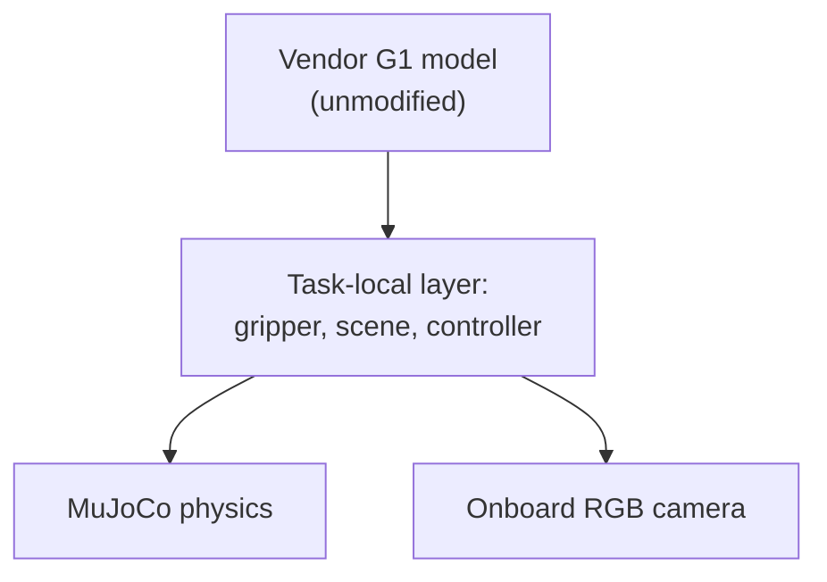
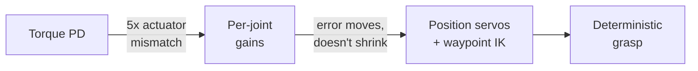
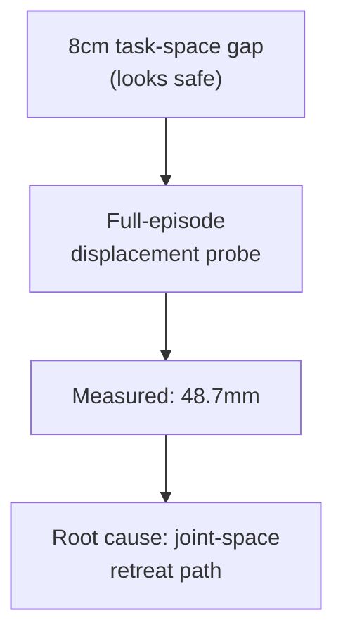

# From Classical Control to VLA-Oriented G1 Demonstrations

Research question: when a classical expert controller fails, what does
diagnosing it teach us about the interfaces a future learned policy
would need?

---

# Entrance-Test Ask vs. What Was Delivered

**Asked for**
- Up to 3 Unitree G1 tasks, increasing difficulty, in Isaac Lab
- Text instruction + setup variants per task
- Verified model-free environment control
- A data-collection pipeline, planned for VLA training
- *Optional*: integrate an existing policy, run inference

**Delivered**
- **2 of 3** tasks, genuinely increasing in difficulty
- **MuJoCo**, not Isaac Lab — a host-availability deviation
- Model-free control: **complete**, real contact/actuation
- VLA-oriented data pipeline: **complete**
- Existing-policy integration: **not attempted**

Full requirement-by-requirement evidence is on the coverage slide later
in this talk.

---

# What I Owned

**Research / engineering decisions**
- Problem decomposition and task scope
- Acceptance criteria and evaluation metrics
- Controller architecture decisions
- Failure hypotheses and instrumentation design
- Experiment design and result interpretation
- VLA observation/action interface design
- Judging whether a result was actually valid

**Implementation workflow**

I used an AI coding agent to accelerate implementation, testing, and
documentation.

I remained responsible for problem decomposition, architecture
decisions, experiment design, reviewing generated implementations,
interpreting failures, and validating every claimed result.

---

# Building the Missing Manipulation Interface

- Audited every pinned G1 variant: **no actuated gripper or hand** in
  any of them
- A free-standing balance probe showed **0.93 m of pelvis drift in
  2 s** → fixed pelvis+torso adopted deliberately
- Built a task-local parallel-jaw gripper (2 actuated fingers, real
  collision pads, explicit TCP site), kept separate from the
  unmodified robot model

All manipulation success is produced through simulated physical
contact and actuation — no post-reset teleportation, attachment, or
artificial grasp assistance.

---

# The Failure Was Architectural, Not a Gain-Tuning Problem

Shoulder/elbow vs. wrist torque authority differs <b>~5×</b>; one
shared gain pair could not serve both. Re-tuning gains only <i>moved</i>
the tracking error (0.061 → 0.215 m in one variant). Replacing the
architecture converged deterministically: <b>0.108 m lift, ~3.5 s hold,
5/5</b> — two independently-budgeted tuning attempts on the same
architecture failed before I replaced the representation itself.

---

# Task 1: Reliable Inside a Measured Envelope, Not Beyond It

- Deterministic nominal success, **5/5** identical reruns
- **3/3 (100%)** of the IK-reachable cube-position variants complete
  the task; 2 of 5 sampled offsets fall outside the reachable envelope
  (predicted by IK check, confirmed live)

<b>Limitation, stated plainly:</b> the strict engineering grasp-slip
target (≤10 mm while grasped) is <b>not met</b> — measured ~25.9 mm.
Task-level behavior is reliable inside the supported envelope; grasp
quality is below the stricter target.

---

# Task-Space Safety ≠ Trajectory Safety

**Expected**: an 8 cm Cartesian gap to a second, nearby object looked
safe by static geometric reasoning.

**Observed**: full-episode instrumentation measured **48.7 mm** of
real displacement — ~5× the 10 mm design target.

**Diagnosis**: traced to the retreat motion's joint-space path
sweeping close to the object — a segment never Cartesian-monitored,
because the static 8 cm gap had looked sufficient.

Fix: re-evaluated candidates on <b>reachability + measured
displacement + camera visibility</b> jointly. Final slot: <b>0.0 /
1.7 mm</b>.

---

# Policy Observations vs. Privileged State: A Clean Split

**Policy-facing observations**
- RGB
- Robot joint state
- TCP pose
- Gripper state

**Privileged expert / evaluation state**
- Cube pose, target pose
- Contact state
- State-machine phase

Privileged state is recorded for evaluation but never silently exposed
as learner input — a design choice, not an afterthought.

---

# A 10 Hz Action Cannot Faithfully Represent a 500 Hz Expert

| Representation | What it tests | Max TCP replay error |
|---|---|---|
| Naive 10 Hz hold | action representation | 48.7 mm |
| Exact 500 Hz execution replay | simulation determinism | 3.65 × 10⁻⁸ m |
| Static per-phase goal @ 10 Hz | action representation | ~97 mm |
| **H=5 sub-action chunks @ 50 Hz (shipped)** | action representation | **8.09 mm** |

Exact replay ruled out simulation nondeterminism — the gap was
entirely in the <b>action representation</b>. Exact-execution replay,
policy-action replay, and a future learned policy are three distinct
things; no model is involved in any row above.

---

# Object-Conditioned Task Specification, Not Language Grounding

Same physical scene, different task specification, different selected
object. `selected_object_id` is supplied by the task specification —
it is not parsed from text or grounded visually in the control loop.

- 4 configurations × 3 deterministic trials = **12/12**
- **0** wrong-object placements, distractor displacement **0.0–1.73 mm**
- Both instructions route to the **same** target pad — the
  instruction changes *which object*, not *where it goes*

---

# Entrance-Test Coverage

| Requirement | Status | Evidence |
|---|---|---|
| Unitree G1 in simulation | **COMPLETE** | Fixed-base, real contact, no teleport |
| Isaac Lab (as specified) | **DEVIATION** | MuJoCo used; Isaac Lab unavailable on dev host |
| Task 1 — pick-and-place | **COMPLETE** | 5 spatial variants, 3/3 reachable succeed |
| Task 2 — object-conditioned select | **PARTIAL** | Instruction selects object; shared single target |
| Task 3 — tool use / multi-object | **NOT ATTEMPTED** | Out of the time box |
| Model-free control, physical interaction | **COMPLETE** | Classical IK + servos, real contact/actuation |
| VLA-oriented data pipeline | **COMPLETE** | RGB, proprioception, actions, privileged split, replay |
| Existing-policy integration / inference | **NOT ATTEMPTED** | No model run in this project |

---
layout: center
class: text-center
---

# What's Next, and Why I Fit This Direction

**What I'd study next**
1. Replace privileged object selection with a **grounded** RGB +
   instruction → object representation
2. Fit the **simplest** baseline first — behavior cloning on existing
   demonstrations before a large VLA
3. Test **real generalization**: unseen positions, paraphrases, new
   object classes — not just repeats of tested configurations

**Why I fit**
- **Robotics**: I can build, instrument, and debug a physically
  grounded manipulation pipeline
- **ML systems**: representation, sampling rates, data interfaces,
  and execution fidelity are habits I already have
- **Research**: comfortable with failed hypotheses and changing
  architecture when measurements contradict the design

I am still early in robotics, but I can already contribute at the
boundary between robot learning and ML systems.

---
layout: section
hideInToc: true
---

# Appendix
## Detailed Evidence for Technical Questions

---

# Appendix A1 — Environment, Vendor Boundary, and the Isaac Lab Deviation

- Host: Intel Mac, macOS 12.7.6, x86_64
- **Isaac Lab requires Linux/Windows and was unavailable on this
  host.** `unitree_mujoco` / MuJoCo was used instead. This is a
  **deviation from the literal entrance-test specification**, not a
  documented, coordinator-approved substitution — no authorization
  record exists in this repository
- `unitreerobotics/unitree_mujoco` pinned at commit `4134cb5`, a git
  submodule; vendor files are never edited
- All manipulation-specific code lives in a task-local layer, checked
  at import time against the unmodified vendor model

---

# Appendix A2 — Controller Tuning History (Full)

| Attempt | Change | Result |
|---|---|---|
| 3-1..3 (torque PD) | gain/feedforward/margin tuning | height 0.005 m of 0.08 m required |
| 3B-1 | per-joint gains by torque authority | TCP RMS 0.061→0.215 m, contact lost |
| 3B-2 | + settle-before-close gate | gate never converged |
| 3B-3 | revert gains + torque-weighted IK | height 0.0005 m of 0.08 m required |
| 3C-1 | position servos, old gripper gains | height 0.0497 m, held 0.198 s, dropped |
| 3C-2 | position servos, gripper gain only | **height 0.108 m, held 3.5 s, 5/5** |

---

# Appendix A3 — Full Task 1 State Machine

RESET→
PREGRASP→
APPROACH→
CLOSE→
VERIFY_CONTACT→
LIFT→
HOLD→
TRANSPORT→
LOWER→
OPEN→
VERIFY_RELEASE→
RETREAT→
VERIFY_SUCCESS→
DONE / FAILED

Objective success detector: 8 conditions, all required continuously
through a settling dwell window. Transport aborts (reports FAILED)
rather than faking success if bilateral contact is lost.

---

# Appendix A4 — Setup-Variant Reachability (Task 1, Full Table)

| Variant | Reachable? | Outcome |
|---|---|---|
| nominal | yes | succeeds |
| x − 0.03 | yes | succeeds |
| y + 0.03 | yes | succeeds |
| x + 0.03 | no (27.1 mm IK residual) | fails at `SETTLE_APPROACH` |
| y − 0.03 | no (8.4 mm IK residual) | fails at `SETTLE_APPROACH` |

Both failures were predicted by a pre-run IK feasibility check before
any trial executed, and the live trial agreed exactly.

---

# Appendix A5 — A Slip Metric That Was Correct Math, Wrong Window

The reported slip metric (15.6 cm) accumulated displacement for the
entire rest of the trial after grasp, including phases where the cube
is *supposed* to separate from the gripper.

- Post-release separation alone: **14.9 cm** — nearly the whole old figure
- The TCP-local-frame transform itself was already correct
- Corrected, gated on the "carrying" signal: genuine grasp-phase slip
  is **3.3–5.4 cm** — no change to any pass/fail outcome

---

# Appendix A6 — Passing Tests ≠ Complete Evaluation

A vendor decorative hand mesh visibly clipped through the cube on
every grasp — found by human visual review after **104/104**
automated tests were already green.

The tests checked contact forces, heights, and velocities. None
checked whether an unrelated, collision-free visual mesh overlapped
the cube — zero prior coverage for that failure mode.

---

# Appendix A7 — An Orientation Fix That Didn't Fix Slip

- Hypothesis: free wrist-roll drift during descent causes off-axis,
  corner-only contact, driving grasp slip
- Measured wrist orientation: jaw axis well-aligned (~4–5° off); the
  "tall" axis was **47° off vertical**
- A stronger orientation objective found a genuine **kinematic
  reachability conflict** — leveling the wrist costs 30–70 mm of
  position error
- A measured finger-mount correction improved contact offset by 17%
  but did **not** reduce overall slip

---

# Appendix A8 — Scaling Exposes a Generalization Gap

32 configurations sampled from a continuous cube-position envelope:
the shipped decoder meets the 10 mm target on 22/29 (76%) episodes.
All 7 offenders first diverge post-release, at `RETREAT` — placement
and success are unaffected. Reported as an open gap, not fixed here.

---

# Appendix A9 — Full Limitations

**Task 1**: strict ≤10 mm slip bar not met (25.9 mm); fixed target
pad; some cube positions outside the reachable envelope; task-local
gripper only; torso-mounted camera; 7/29 scaled replay episodes
exceed 10 mm (all post-release).

**Task 2**: optional, time-boxed; object identity is privileged
metadata, not inferred; both instructions share one target pad; only
2 spatial arrangements were tested, each with 3 *deterministic
repeats*, not distinct seeds; no scaled dataset or policy integration.

**Project-wide**: no model has been trained or evaluated. Every result
above is produced by a scripted expert controller.

---

# Appendix A10 — Process Evidence: Design, Problems, and Time

- Task design and rationale, problem encounters, and results are
  logged per development phase in the project's own working notes
- Selected failures needing the most research reasoning: torque-control
  instability (Appendix A2), the decorative-hand visual defect
  (Appendix A6), and the action-representation replay gap (main deck)
- **Time commitment**: per-phase estimates exist for roughly half the
  development phases (~12 hours documented across the phases that
  logged it); a single aggregated total across the full project was
  **not tracked** — flagged here rather than estimated
- 311 regression tests, 0 unexpected failures, reproducible from a
  fixed seed and a committed config hash
- Task 1 and Task 2 demonstration videos exist and are decode-verified
